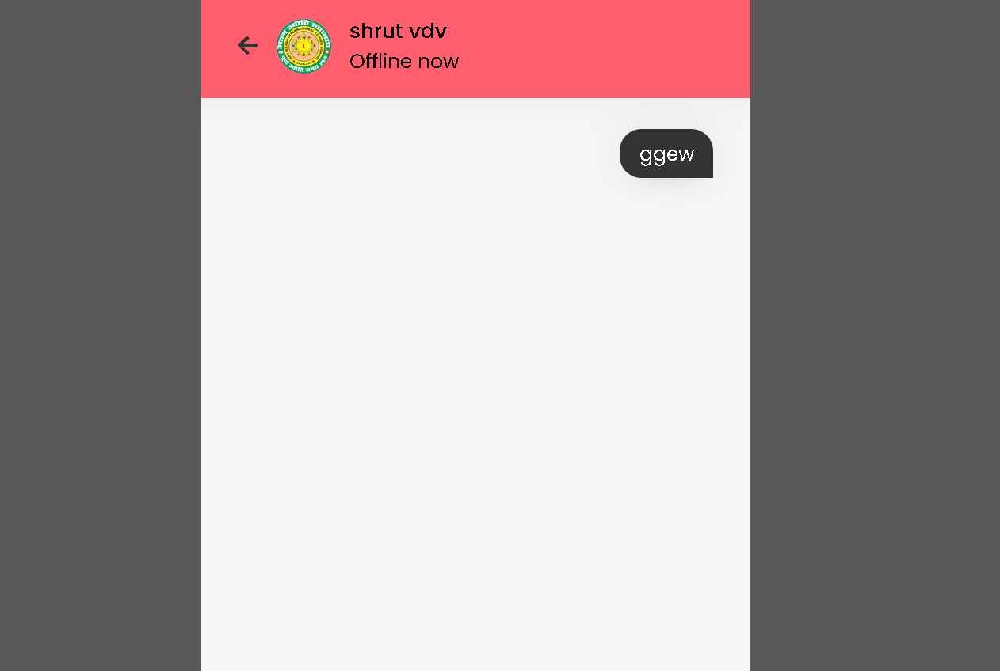

# VibeChat

VibeChat is a real-time chat application designed to enhance communication and bring users together. With its user-friendly interface and smooth functionality, VibeChat allows users to chat seamlessly across different platforms.

Features

    Real-Time Messaging: Instant communication with real-time updates.
    User Authentication: Secure login and registration.
    Responsive Design: Optimized for both desktop and mobile devices.

Tech Stack
    Frontend: HTML, CSS, JavaScript, XML
    Backend: PHP
    Database: MySQL

Screenshots
<h4>Chat Interface</h4>
  

<h4>User Profiles</h4>

<h4>2.</h4>

 Installation

   1. Clone the repository:
             git clone https://github.com/your-username/VibeChat.git

  2. Move the project to the XAMPP htdocs folder:
              mv VibeChat /opt/lampp/htdocs
     
  3.Start XAMPP:
         Open the XAMPP Control Panel and start Apache and MySQL.

  4.Set up the database:

          Open phpMyAdmin (usually at http://localhost/phpmyadmin) and import the SQL file located in the database folder to create the necessary tables.

  5.
    Access VibeChat by opening your browser and navigating to http://localhost/VibeChat.

   Usage

    Sign Up: Create a new account to access VibeChat.
    Chat: Start chatting with friends or join group conversations.

  Contributing

      We welcome contributions! If you would like to add features or report issues, feel free to submit a pull request or open an issue.

      Fork the project.
      Create your feature branch (git checkout -b feature/NewFeature).
      Commit your changes (git commit -m 'Add new feature').
      Push to the branch (git push origin feature/NewFeature).
      Open a pull request.

   
 

